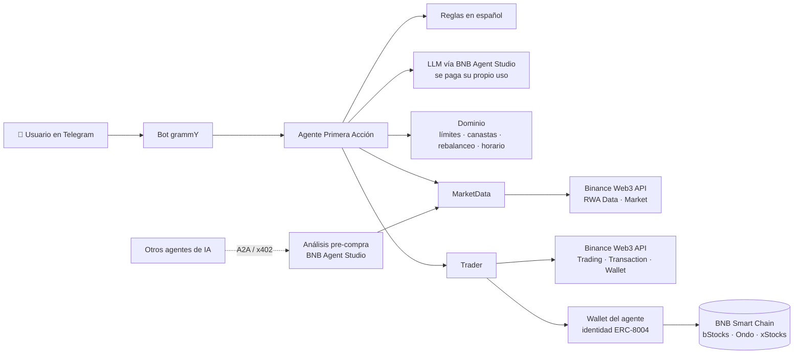

# Primera Acción 🇧🇴

**Tu primera acción de Wall Street desde Telegram, en español, con USDT.**

Un agente de IA que te deja comprar acciones tokenizadas de empresas de EE.UU. (Apple, NVIDIA, Tesla, el S&P 500…) en BNB Smart Chain escribiendo como hablas: _"compra 10 de nvidia"_. Proyecto para el **BNB Hack: Tokenized Stocks Edition**, nacido en las **BNB Builder Sessions de Santa Cruz, Bolivia**.

## Contribuyentes

<table>
  <tr>
    <td align="center">
      <a href="https://github.com/invertilo">
        <br />
        <b>Vinicius</b>
      </a><br />
      <sub>@invertilo</sub>
    </td>
    <td align="center">
      <a href="https://github.com/alejondr3">
        <br />
        <b>Alejandro Mendoza</b>
      </a><br />
      <sub>@alejondr3</sub>
    </td>
    <td align="center">
      <a href="https://github.com/jasiiid">
        <br />
        <b>Jasid Moron</b>
      </a><br />
      <sub>@jasiiid</sub>
    </td>
  </tr>
</table>

---

## El problema

En Bolivia y en buena parte de Latinoamérica, invertir en acciones de EE.UU. es complicado: abrir una cuenta en un broker extranjero es lento, pide papeleo y mover dinero al exterior no es simple. Las **acciones tokenizadas** en BNB Chain resuelven el acceso (se compran con USDT, desde 1 dólar, 24/7), pero usarlas hoy exige saber de wallets, DEX, slippage y contratos.

## La solución

**Primera Acción** es un agente que conversa en español y se encarga de la parte técnica:

```
Tú:    compra 20 de apple
Bot:   🧾 Comprar 20,00 USDT de AAPL
       🟢 Compra AAPL vía bStocks: 20,00 USDT ≈ 0,1010 tokens
          precio 198,02 USDT (-0,49% vs referencia) · slippage máx 0,50% · gas ≈ 0,05 USDT
       🌙 Bolsa cerrada (fin de semana)
       ⚠️ La bolsa de EE.UU. está cerrada: el token sigue operando, pero su precio
          puede moverse distinto al de la acción hasta la próxima apertura.
       ✅ Simulación OK. ¿Confirmas?          [ ✅ Confirmar ]  [ ✖️ Cancelar ]
```

_(Ejemplo ilustrativo con precios ficticios.)_

### Qué puede hacer

| Función | Ejemplo |
|---|---|
| Consultar precios (onchain vs. precio real de la acción) | `precio de tesla` |
| Comprar y vender con USDT | `compra 10 de nvidia` · `vende todo mi apple` |
| Elegir el mejor emisor automáticamente | Si AAPL existe en bStocks, Ondo y xStocks, cotiza en los tres y elige el de mejor precio |
| Canastas temáticas armadas por ti | `canasta chips NVDA 40 AMD 30 TSM 30` |
| Invertir en una canasta de una vez | `invierte 50 en chips` |
| Rebalancear | `rebalancea mi canasta chips` |
| Compras programadas (DCA) | `compra 20 de mi canasta chips cada 7 días` |
| Ver portafolio e historial | `portafolio` · `historial` |
| Aprender | `¿qué es una acción tokenizada?` |

Las frases frecuentes se entienden con reglas (rápido y gratis). Lo demás lo interpreta un LLM, que siempre devuelve una orden estructurada y validada, nunca una transacción.

## Seguridad primero

Mover dinero real con un agente de IA exige límites claros. Por eso:

- **Nada se ejecuta sin tu confirmación.** Cada orden muestra precio, slippage, brecha con el precio de referencia y una **simulación onchain** antes del botón _Confirmar_.
- **El LLM nunca firma.** La firma vive en código fijo; el modelo solo interpreta texto (mismo principio que BNB Agent Studio: herramientas del LLM de solo lectura).
- **Límites configurables:** máximo por operación, máximo diario, slippage máximo y aviso si el precio onchain se separa del precio real.
- **Cotizaciones con vencimiento:** si pasan más de 60 s entre la cotización y la confirmación, se vuelve a cotizar.
- **Wallet privada:** solo los IDs de Telegram autorizados pueden operar. Cualquier otra persona puede consultar precios y hacer preguntas, pero no operar ni ver el portafolio.
- **Aviso de horario de mercado:** con la bolsa de EE.UU. cerrada (noches, fines de semana, feriados) el agente te advierte que el precio puede desviarse.
- **No da recomendaciones de inversión.** Ejecuta lo que tú decides y, si le pides consejo, explica qué mirar sin decirte qué comprar.

## Arquitectura



- **`src/domain/`**: lógica pura y testeada: canastas, plan de rebalanceo, horario de la bolsa de EE.UU., límites de seguridad.
- **`src/agent/`**: el cerebro: interpreta mensajes (reglas + LLM), cotiza en todos los emisores, simula, aplica límites y gestiona confirmaciones y DCA.
- **`src/ports.ts`**: interfaces `MarketData`, `Trader` y `Llm`. El agente no depende de un proveedor concreto, así que se prueba con un mercado simulado y se conecta a las APIs reales sin tocar la lógica.
- **`src/telegram/`**: el bot (botones de confirmación, scheduler de compras programadas).
- **BNB Agent Studio**: aporta la wallet del agente, su identidad onchain **ERC-8004**, el LLM que se autofinancia (Pieverse) y una cara pública **A2A / x402** para que otros agentes compren el _análisis pre-compra_ (precio, brecha, liquidez y horario para un monto dado).

> El deploy gestionado de prueba de Agent Studio (48 h) es solo testnet y apaga los procesos inactivos, mientras que las acciones tokenizadas viven en mainnet. Por eso el bot de Telegram corre como un proceso propio, siempre encendido, que usa la misma wallet e identidad del agente.

## Estado del proyecto

- [x] Dominio: canastas, rebalanceo, horario de mercado, límites de seguridad
- [x] Agente: intérprete en español, mejor emisor, simulación, confirmación, vencimiento de cotizaciones, permisos
- [x] Bot de Telegram con confirmación por botones y compras programadas (DCA)
- [x] 43 tests automáticos
- [ ] Conexión a Binance Web3 API (RWA Data, Trading, Transaction, Wallet)
- [ ] Integración con BNB Agent Studio (wallet, ERC-8004, LLM Pieverse, cara A2A / x402)
- [ ] Deploy en mainnet y demo en video
- [ ] Reporte de Developer Experience ([`DX_LOG.md`](DX_LOG.md))

## Cómo correrlo

Requisitos: Node.js 22 o superior.

```bash
git clone https://github.com/invertilo/bnb-builder-day.git
cd bnb-builder-day
npm install
npm test
```

Las instrucciones para levantar el bot (`.env`, token de Telegram, wallet del agente y claves de API) se agregan cuando estén conectadas las APIs reales.

## Estructura

```
src/
├── agent/
│   ├── intents.ts      # intérprete de frases en español → órdenes estructuradas
│   ├── prompts.ts      # instrucciones del LLM (sin recomendaciones de inversión)
│   └── service.ts      # orquestador: cotiza, simula, aplica límites y confirma
├── domain/
│   ├── baskets.ts      # canastas y pesos
│   ├── market-hours.ts # horario y feriados de la bolsa de EE.UU.
│   ├── policy.ts       # límites de seguridad
│   ├── rebalance.ts    # plan de compras y ventas para una canasta
│   └── types.ts
├── i18n/es.ts          # textos en español
├── telegram/bot.ts     # bot grammY + scheduler de DCA
├── ports.ts            # interfaces MarketData / Trader / Llm
└── store.ts            # persistencia simple en JSON
```

## Hackathon

- **Evento:** [BNB Hack: Tokenized Stocks Edition](https://bnbchain.org/en/hackathons/tokenized-stocks), del 16 de septiembre al 11 de octubre de 2026
- **Track:** Tokenized Stocks Products & Agents
- **Emisores:** bStocks, Ondo y xStocks en BSC mainnet (solo spot)
- **Premios especiales a los que apuntamos:** Best Use of BNB Agent Studio · Best Use of Agentic Wallet / Wallet Skills

## Aviso

Primera Acción es un proyecto experimental de hackathon. No es asesoría financiera ni de inversión. Las acciones tokenizadas implican riesgos: dependes del emisor, puede haber poca liquidez, el precio onchain puede desviarse del precio real y los derechos (dividendos, voto) dependen de cada emisor. Invierte solo lo que puedas perder.
