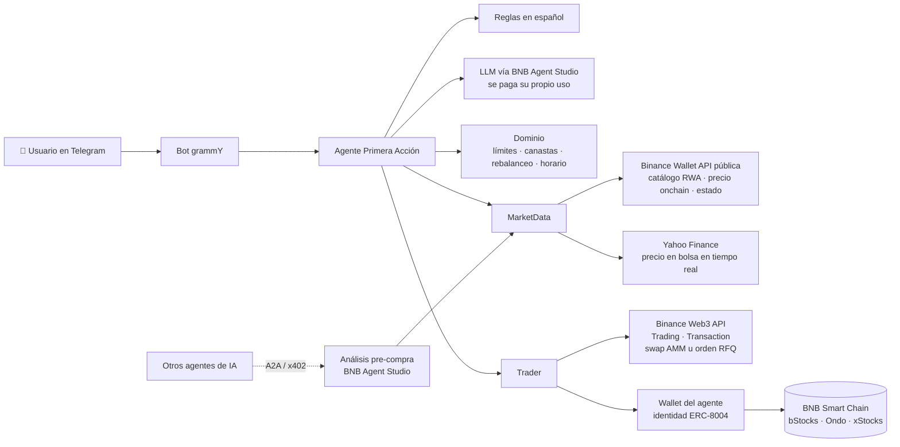

# Primera Acción 🇧🇴

**Tu primera acción de Wall Street desde Telegram, en español, con USDT.**

Un agente de IA que te deja comprar acciones tokenizadas de empresas de EE.UU. (Apple, NVIDIA, Tesla, el S&P 500…) en BNB Smart Chain escribiendo como hablas: _"compra 10 de nvidia"_. Proyecto para el **BNB Hack: Tokenized Stocks Edition**, nacido en las **BNB Builder Sessions de Santa Cruz, Bolivia**.

## Contribuyentes

<table>
  <tr>
    <td align="center">
      <a href="https://github.com/invertilo">
        <br />
        <b>Vinicius</b>
      </a><br />
      <sub>@invertilo</sub>
    </td>
    <td align="center">
      <a href="https://github.com/alejondr3">
        <br />
        <b>Alejandro Mendoza</b>
      </a><br />
      <sub>@alejondr3</sub>
    </td>
    <td align="center">
      <a href="https://github.com/jasiiid">
        <br />
        <b>Jasid Moron</b>
      </a><br />
      <sub>@jasiiid</sub>
    </td>
  </tr>
</table>

---

## El problema

En Bolivia y en buena parte de Latinoamérica, invertir en acciones de EE.UU. es complicado: abrir una cuenta en un broker extranjero es lento, pide papeleo y mover dinero al exterior no es simple. Las **acciones tokenizadas** en BNB Chain resuelven el acceso (se compran con USDT, con montos chicos y a cualquier hora), pero usarlas hoy exige saber de wallets, DEX, slippage y contratos.

## La solución

**Primera Acción** es un agente que conversa en español y se encarga de la parte técnica:

```
Tú:    compra 25 de apple
Bot:   🧾 Comprar 25,00 USDT de AAPL
       🟢 Compra AAPLB (bStocks): 25,00 USDT ≈ 0,0749 tokens
          precio 333,70 USDT (-0,03% vs bolsa) · slippage máx 1,00% · impacto 0,10%
          ruta: PcsXRfq · orden RFQ
       🌙 Bolsa cerrada (fin de semana)
       ⚠️ La bolsa de EE.UU. está cerrada: el token sigue operando, pero su precio
          puede moverse distinto al de la acción hasta la próxima apertura.
       ℹ️ Ondo y bStocks se ejecutan como orden RFQ firmada: Binance la completa onchain.
       ✅ Chequeos previos OK. ¿Confirmas?          [ ✅ Confirmar ]  [ ✖️ Cancelar ]
```

_(Ejemplo ilustrativo: la cotización y la ruta varían.)_

### Qué puede hacer

| Función | Ejemplo |
|---|---|
| Precio **en tiempo real de la bolsa** (incluye pre y post mercado) frente al precio de cada token | `precio de tesla` |
| Análisis con IA usando datos reales (sin recomendar compras) | `analiza nvidia` |
| Comprar y vender con USDT | `compra 10 de nvidia` · `vende todo mi apple` |
| Elegir el mejor emisor automáticamente | Si AAPL existe en bStocks, Ondo y xStocks, cotiza en los tres y elige el de mejor precio |
| Canastas temáticas armadas por ti | `canasta chips NVDA 40 AMD 30 TSM 30` |
| Invertir en una canasta de una vez | `invierte 50 en chips` |
| Rebalancear | `rebalancea mi canasta chips` |
| Compras programadas (DCA) | `compra 20 de mi canasta chips cada 7 días` |
| Ver portafolio e historial | `portafolio` · `historial` |
| Aprender | `¿qué es una acción tokenizada?` |

Las frases frecuentes se entienden con reglas (rápido y gratis). Lo demás lo interpreta un LLM (**`deepseek-v4-flash` vía AgentRouter**, compatible con OpenAI), que siempre devuelve una orden estructurada y validada, nunca una transacción.

### Precios en tiempo real

- **Acción en bolsa:** Yahoo Finance, con hora exacta y sesión (en vivo, pre-mercado, post-mercado). Si falla, se usa el precio de bolsa que publica Binance.
- **Token onchain:** Binance Wallet (endpoints públicos de RWA), con el multiplicador de cada emisor (dividendos reinvertidos, splits).
- **Brecha:** precio del token contra precio de la acción × multiplicador. Con la bolsa cerrada, la brecha muestra cuánto se adelanta el mercado onchain.

## Seguridad primero

Mover dinero real con un agente de IA exige límites claros. Por eso:

- **Nada se ejecuta sin tu confirmación.** Cada orden muestra precio, slippage, brecha con el precio de referencia y una **simulación onchain** antes del botón _Confirmar_.
- **El LLM nunca firma.** La firma vive en código fijo; el modelo solo interpreta texto (mismo principio que BNB Agent Studio: herramientas del LLM de solo lectura).
- **Límites configurables:** máximo por operación, máximo diario, slippage máximo y aviso si el precio onchain se separa del precio real.
- **Cotizaciones con vencimiento:** si pasan más de 60 s entre la cotización y la confirmación, se vuelve a cotizar.
- **Wallet privada:** solo los IDs de Telegram autorizados pueden operar. Cualquier otra persona puede consultar precios y hacer preguntas, pero no operar ni ver el portafolio.
- **Aviso de horario de mercado:** con la bolsa de EE.UU. cerrada (noches, fines de semana, feriados) el agente te advierte que el precio puede desviarse.
- **No da recomendaciones de inversión.** Ejecuta lo que tú decides y, si le pides consejo, explica qué mirar sin decirte qué comprar.

## Arquitectura



- **`src/domain/`**: lógica pura y testeada: canastas, plan de rebalanceo, horario de la bolsa de EE.UU., límites de seguridad.
- **`src/agent/`**: el cerebro: interpreta mensajes (reglas + LLM), cotiza en todos los emisores, simula, aplica límites y gestiona confirmaciones y DCA.
- **`src/ports.ts`**: interfaces `MarketData`, `Trader` y `Llm`. El agente no depende de un proveedor concreto, así que se prueba con un mercado simulado y se conecta a las APIs reales sin tocar la lógica.
- **`src/binance/`**: clientes de Binance. `public.ts` (catálogo y precios sin clave), `auth.ts` (firma HMAC), `market.ts` y `trader.ts`. Ondo y bStocks se ejecutan como **orden RFQ firmada (EIP-712)** y xStocks como swap normal. Antes de firmar se aprueba el gasto justo, se simula, se envía con **protección MEV** y se verifica el mínimo garantizado.
- **`src/stocks/quotes.ts`**: precio de la acción en bolsa (Yahoo Finance con respaldo de Binance).
- **`src/llm/`**: cliente compatible con OpenAI (AgentRouter + `deepseek-v4-flash`).
- **`src/telegram/`**: el bot (botones de confirmación, scheduler de compras programadas).
- **`studio/`**: el agente de **BNB Agent Studio** (generado con `bag init`). Expone el _análisis pre-compra_ por **A2A** y por **`/x402` gratis**, para que otros agentes de IA lo consuman. Tiene identidad onchain **ERC-8004** y firma con su propia wallet en código fijo, nunca desde el LLM. Detalles en la [guía de Agent Studio](docs/AGENT_STUDIO.md).

> El deploy gestionado de prueba de Agent Studio (48 h) es solo testnet y apaga los procesos inactivos, mientras que las acciones tokenizadas viven en mainnet. Por eso el bot de Telegram corre como un proceso propio, siempre encendido, que usa la misma wallet e identidad del agente.

## Estado del proyecto

- [x] Dominio: canastas, rebalanceo, horario de mercado, límites de seguridad
- [x] Agente: intérprete en español, mejor emisor, simulación, confirmación, vencimiento de cotizaciones, permisos
- [x] Bot de Telegram con confirmación por botones y compras programadas (DCA)
- [x] Catálogo real de acciones tokenizadas en BSC (Ondo y bStocks) y precios onchain en vivo
- [x] Precio de la acción en bolsa en tiempo real (Yahoo Finance + respaldo de Binance)
- [x] IA con `deepseek-v4-flash` vía AgentRouter: interpreta mensajes y analiza acciones con datos reales
- [x] Trading con la Binance Web3 API: cotización, aprobación, swap u orden RFQ, simulación, envío con protección MEV
- [x] Portafolio leído onchain (Multicall3 sobre todo el catálogo)
- [x] Agente de BNB Agent Studio en `studio/` con nuestro análisis en `runWork`, probado local con `bag dev` y `/x402` ([guía](docs/AGENT_STUDIO.md))
- [x] CI (tests del bot + compilación del agente de Agent Studio) y Dockerfile para el bot
- [x] 77 tests automáticos
- [ ] Probar con la API key de Binance y una wallet con fondos (primera compra real en mainnet)
- [ ] Deploy del agente de Agent Studio (trial de 48 h) y registro ERC-8004
- [ ] Deploy del bot y demo en video
- [ ] Reporte de Developer Experience ([`DX_LOG.md`](DX_LOG.md))

## Cómo correrlo

Requisitos: Node.js 22 o superior.

```bash
git clone https://github.com/invertilo/bnb-builder-day.git
cd bnb-builder-day
npm install
cp .env.example .env
```

Completa `.env`:

| Variable | Para qué | ¿Obligatoria? |
|---|---|---|
| `TELEGRAM_BOT_TOKEN` | Token del bot (créalo con [@BotFather](https://t.me/BotFather)) | Sí |
| `TELEGRAM_TRADER_IDS` | IDs de Telegram que pueden operar (el bot te dice tu ID) | Para operar |
| `LLM_API_KEY` | Clave de AgentRouter para `deepseek-v4-flash` | Para la IA |
| `BINANCE_API_KEY` / `BINANCE_API_SECRET` | [Binance Web3 dev portal](https://web3.binance.com/en/dev-portal) con Trading, Market, Wallet y Transaction | Para operar |
| `AGENT_PRIVATE_KEY` | Wallet del agente. Créala con `npm run wallet:new` | Para operar |

Sin las claves de Binance o sin wallet, el bot funciona en **modo solo lectura**: precios, análisis y preguntas.

```bash
npm run check NVDA 25   # diagnóstico: catálogo, precio en bolsa, IA, firma Binance, wallet y cotización (no ejecuta nada)
npm run dev             # levanta el bot de Telegram
npm test                # 77 tests
```

Para operar, la wallet del agente necesita USDT (Ondo pide órdenes de ~20 USD como mínimo) y un poco de BNB para gas, en BNB Smart Chain.

### Deploy del bot

El bot es un proceso que tiene que quedar siempre encendido (long polling de Telegram, sin puertos abiertos). Con Docker:

```bash
docker build -t primera-accion .
docker run -d --name primera-accion --env-file .env -v primera-data:/app/data --restart unless-stopped primera-accion
```

Sirve en cualquier VPS o servicio que corra contenedores (Railway, Fly.io, Render como _background worker_). El volumen `data/` guarda canastas, compras programadas e historial.

### Agente de BNB Agent Studio

Ver [docs/AGENT_STUDIO.md](docs/AGENT_STUDIO.md): `npm run studio:sync`, `bag dev` y `bag deploy --provider bnb`.

## Estructura

```
src/
├── agent/
│   ├── intents.ts      # intérprete de frases en español → órdenes estructuradas
│   ├── prompts.ts      # instrucciones del LLM (sin recomendaciones de inversión)
│   └── service.ts      # orquestador: cotiza, simula, aplica límites y confirma
├── binance/
│   ├── auth.ts         # cliente firmado (HMAC) de la Binance Web3 API
│   ├── market.ts       # catálogo, precio onchain vs bolsa, estado del emisor
│   ├── public.ts       # endpoints públicos de Binance Wallet
│   └── trader.ts       # cotización, aprobación, swap / RFQ, simulación, portafolio
├── llm/openai-compatible.ts  # AgentRouter · deepseek-v4-flash
├── stocks/quotes.ts    # precio en bolsa en tiempo real
├── studio/run-work.ts  # análisis pre-compra para BNB Agent Studio
├── wallet/signer.ts    # firma local (viem)
├── scripts/            # check (diagnóstico) y new-wallet
├── app.ts              # arma todo según el .env (con modo solo lectura)
├── config.ts           # validación del .env
├── index.ts            # entrada del bot
├── domain/
│   ├── baskets.ts      # canastas y pesos
│   ├── market-hours.ts # horario y feriados de la bolsa de EE.UU.
│   ├── policy.ts       # límites de seguridad
│   ├── rebalance.ts    # plan de compras y ventas para una canasta
│   └── types.ts
├── i18n/es.ts          # textos en español
├── telegram/bot.ts     # bot grammY + scheduler de DCA
├── ports.ts            # interfaces MarketData / Trader / Llm
└── store.ts            # persistencia simple en JSON
studio/                 # agente de BNB Agent Studio (bag init) con nuestro runWork
scripts/studio-sync.mjs # copia src/ al agente de Agent Studio antes de dev/deploy
docs/AGENT_STUDIO.md    # guía de Agent Studio
Dockerfile              # imagen del bot
```

## Hackathon

- **Evento:** [BNB Hack: Tokenized Stocks Edition](https://bnbchain.org/en/hackathons/tokenized-stocks), del 16 de septiembre al 11 de octubre de 2026
- **Track:** Tokenized Stocks Products & Agents
- **Emisores:** bStocks, Ondo y xStocks en BSC mainnet (solo spot)
- **Premios especiales a los que apuntamos:** Best Use of BNB Agent Studio · Best Use of Agentic Wallet / Wallet Skills

## Aviso

Primera Acción es un proyecto experimental de hackathon. No es asesoría financiera ni de inversión. Las acciones tokenizadas implican riesgos: dependes del emisor, puede haber poca liquidez, el precio onchain puede desviarse del precio real y los derechos (dividendos, voto) dependen de cada emisor. Invierte solo lo que puedas perder.
